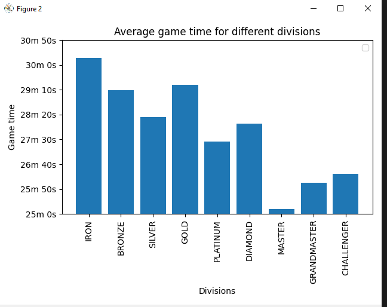
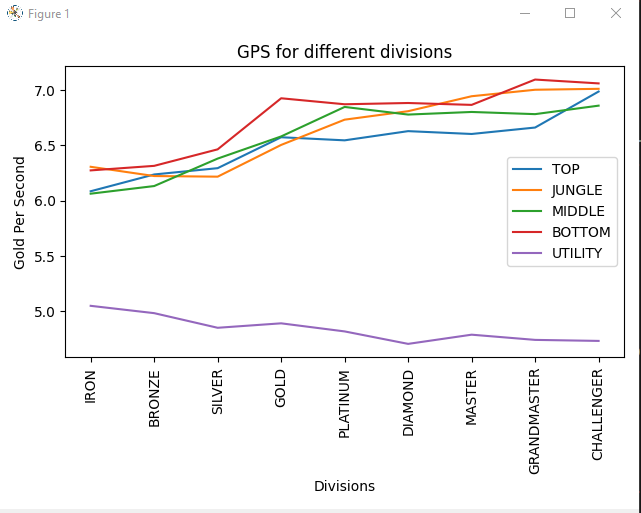
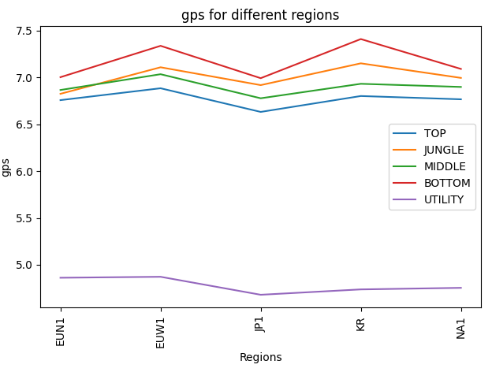
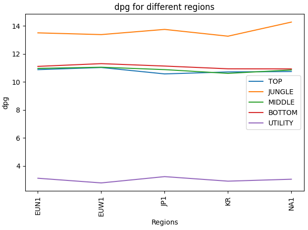
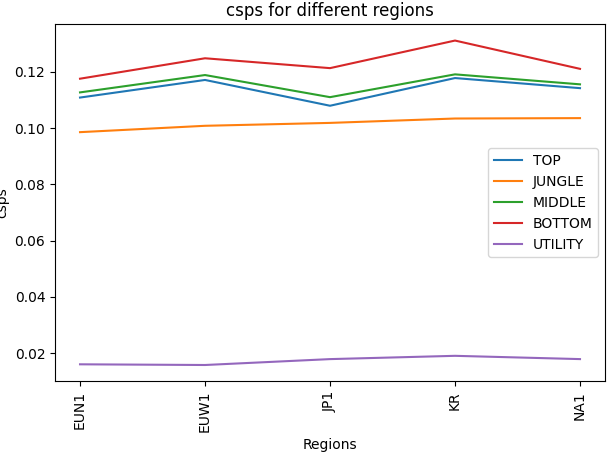
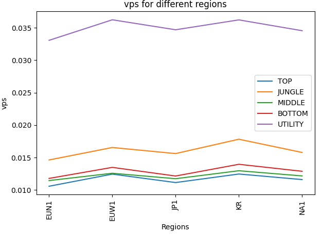

# HW_02

Unzip matches.rar to access .json files for matches.\
Get an API key to access their data at:\
https://developer.riotgames.com/ 

## Average time per match by division
In order to see the difference in match times for different divisions, I used the Riot API to get data. 
I expected that the higher divisions would have shorter game times.
This is somewhat confirmed by the data.
I got 50 matches for 5 different players in each division.

### Average Gold per Sec by division for different roles

In order to see the difference in GPS for different divisions, I used the Riot API to get data. 
I expected that the higher divisions would have higher GPS and that by roles it would rank (BOT,MID,TOP,JUNGLE,SUPPORT)
This is somewhat confirmed by the data. Higher divisions had higher GPS, but the ranking by role was different for each division.
I got 50 matches for 5 different players in each division and calculated for all players in each match.

#### Average Gold Per Sec for Challengers in different regions

Using the Riot API, I got the match data of Challengers in different regions.
For each region, I got 50 matches from all the challengers, taking out duplicate matches.

#### Average Damage Per Gold for Challengers in different regions

#### Average CS Per Sec for Challengers in different regions

#### Average Vision Score Per Sec for Challengers in different regions

https://github.com/mikeizbicki/cmc-csci040/tree/2021fall/hw_02
